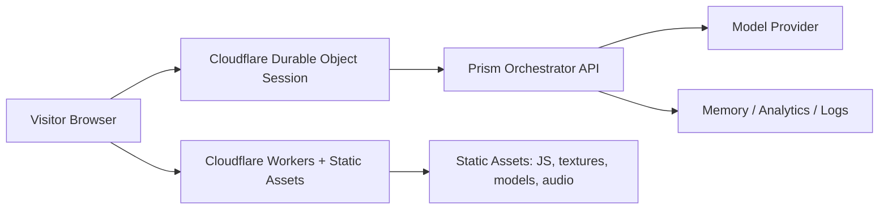

# Prism Deployment Plan

## Goal

Turn Prism from a demo object into a public interactive site where visitors can talk to a "living" dodecahedron that feels present, responsive, and premium from the first load.

## Core Technical Reality

If Prism remains a browser-based `Three.js/WebGL` experience, the 3D scene is rendered on each visitor's device. A more powerful cloud server can improve:

- asset delivery
- API latency
- voice/chat response time
- session coordination

But it cannot keep the scene "already rendered" for every visitor unless the product becomes a streamed GPU application.

## Recommendation

Build Prism as a normal edge-hosted website first.

Do not start with cloud-rendered graphics.

Use a globally cached frontend plus a low-latency realtime backend so the site feels instant and alive without the cost and complexity of application streaming.

## Recommended Architecture

## Hosting Choice

### Frontend

Use Cloudflare Workers with Static Assets as the primary deployment target.

Why:

- best fit for a Vite/SPA WebGL microsite
- global edge delivery for static assets
- easy SPA routing
- can colocate lightweight API logic with the site
- can add Durable Objects later without changing vendors

### Realtime Session Layer

Use Cloudflare Durable Objects for live session state and WebSocket coordination.

Why:

- good fit for one active Prism conversation per visitor/session
- supports WebSocket hibernation, which keeps connections alive while reducing idle cost
- ideal for presence, turn state, typing/thinking state, and short-lived memory

### AI Layer

Use a managed model API first.

Recommended v1:

- text chat via Responses API
- voice later via Realtime API

Why:

- fastest path to production
- no GPU fleet to operate
- easiest way to prototype "alive" behavior
- lets us spend effort on Prism orchestration, not model ops

### Optional Self-Hosted AI Layer

If you later want your own hosted model:

- first choice: Modal
- second choice: Runpod

Why:

- Modal has clean serverless GPU execution and clear GPU pricing
- Runpod emphasizes pre-warmed serverless GPUs and low cold-start behavior

## "Alive" Product Behavior

Prism should not just answer text. It should run a visible state machine.

Recommended core states:

- `idle`: ambient breathing, subtle eye-contact behavior, low glow
- `noticing`: user enters, Prism slightly reorients and brightens
- `listening`: user typing or speaking, more attentive tilt and pulse
- `thinking`: active teal/gold cognitive motion during inference
- `speaking`: response cadence, rings, core pulse, optional voice output
- `resting`: settles back to idle after reply
- `sleeping`: low-power state after inactivity

The LLM is only one subsystem. The "alive" feel comes from orchestration:

- presence detection
- input activity detection
- streaming token events
- speech timing
- post-response settling behavior

## Deployment Phases

### Phase 0: Extract and Harden the Microsite

Deliverables:

- standalone Prism microsite route or standalone app
- production asset pipeline
- compressed textures / models
- lazy loaded secondary UI
- poster frame fallback and shader warm-up
- performance budget for first load

Exit criteria:

- public deploy works reliably
- first render is visually stable on desktop and mobile

### Phase 1: Public Text Chat Launch

Stack:

- Cloudflare Workers + Static Assets
- Cloudflare Durable Objects
- Responses API-backed Prism orchestrator

Deliverables:

- typed chat with streaming responses
- Prism visual states wired to session lifecycle
- lightweight memory per session
- analytics, logs, and rate limits
- public domain + TLS

Exit criteria:

- users can open site, chat, and see Prism react in real time
- no GPU infrastructure required

### Phase 2: Voice and Realtime Presence

Stack:

- keep frontend on Cloudflare
- add Realtime API for voice sessions

Deliverables:

- tap-to-talk or hold-to-talk
- Prism listening / speaking states
- ephemeral client secrets for browser sessions
- voice interruption handling
- turn timeout and reconnect behavior

Exit criteria:

- users can talk to Prism naturally
- latency feels conversational

### Phase 3: Production Hardening

Deliverables:

- cost caps and abuse controls
- observability dashboards
- fallback text model for degraded mode
- persistent user memory if desired
- queueing / admission control for spikes
- A/B testing for visual behaviors

Exit criteria:

- safe to market publicly
- predictable spend under traffic

### Phase 4: Optional Self-Hosted Model

Only do this if at least one of these becomes true:

- API spend is too high
- you need custom/self-hosted models
- you need private model control

Recommended order:

1. Modal GPU prototype
2. Runpod pre-warmed serverless or dedicated endpoint
3. full custom GPU fleet only if traffic and economics justify it

## Estimated Monthly Cost Bands

These are planning bands, not quotes.

### Option A: Recommended v1, Managed AI

- Cloudflare Workers paid plan: around `$5/month` base before usage
- domain + DNS: low double-digits per year
- optional database / analytics / logging: `$0-50/month`
- model spend: usage-based

This is the best starting point.

### Option B: Warm Self-Hosted GPU

Using Modal pricing as a rough planning reference:

- L4 at `$0.000222/sec` is about `$0.80/hour`, or roughly `$580/month` if kept warm 24/7
- A10 at `$0.000306/sec` is about `$1.10/hour`, or roughly `$800/month` if kept warm 24/7
- L40S at `$0.000542/sec` is about `$1.95/hour`, or roughly `$1,425/month` if kept warm 24/7

This is why self-hosted GPU should be phase 4, not phase 1.

### Option C: Cloud-Rendered Graphics / App Streaming

This is the most expensive path and should not be the first deployment.

You would be paying for:

- GPU rendering
- stream transport
- session capacity per concurrent user
- more complex infra and monitoring

This behaves more like cloud gaming than a website.

## Why Not Start With App Streaming

App streaming only makes sense if one of these is true:

- Prism must render identically regardless of user hardware
- you need graphics features that browsers cannot handle well
- the visual fidelity goal is closer to Unreal / offline rendering

For a premium interactive WebGL site, it is the wrong starting point.

## Optional App-Streaming Fallback

If leadership insists on cloud-rendered visuals later, evaluate:

- Amazon AppStream 2.0 Graphics G6
- EC2 G6 or G6e with NICE DCV / custom WebRTC streaming

Treat that as a separate product architecture, not an optimization of the website path.

## Implementation Priorities

### Immediate

- deploy Prism as a public microsite on Cloudflare
- wire typed chat to Prism visual state machine
- add streaming responses
- instrument load time and session latency

### Next

- add voice
- add short-term session memory
- add onboarding presence and greeting behaviors

### Later

- self-host model if economics justify it
- add persistent identity and memory
- add premium streaming-only mode if ever truly required

## Final Recommendation

Build Prism as:

- Cloudflare-hosted browser-rendered WebGL frontend
- Durable Object-backed live session layer
- managed AI API first
- self-hosted GPU later only if needed

That is the right deployment strategy for a public interactive Prism site that feels alive without becoming an expensive remote-rendering system.

## Sources

- Cloudflare Workers Static Assets: https://developers.cloudflare.com/workers/static-assets/
- Cloudflare Workers pricing: https://developers.cloudflare.com/workers/platform/pricing/
- Cloudflare pricing overview: https://workers.cloudflare.com/pricing
- Cloudflare Durable Objects WebSockets: https://developers.cloudflare.com/durable-objects/best-practices/websockets/
- Vercel pricing: https://vercel.com/pricing
- Modal GPU reference: https://modal.com/docs/reference/modal.gpu
- Modal pricing: https://modal.com/pricing
- Runpod serverless: https://www.runpod.io/product/serverless
- Runpod pricing: https://www.runpod.io/pricing
- OpenAI Realtime guide: https://developers.openai.com/api/docs/guides/realtime
- OpenAI Responses guide: https://developers.openai.com/api/docs/guides/migrate-to-responses
- OpenAI API pricing: https://openai.com/api/pricing/
